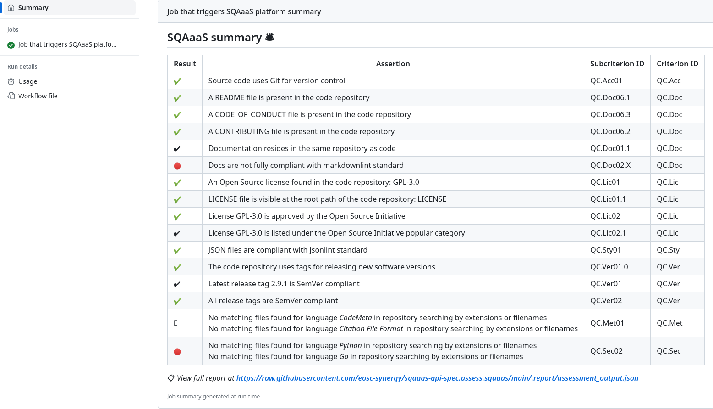

<!--
SPDX-FileCopyrightText: Copyright contributors to the Software Quality Assurance as a Service (SQAaaS) project.

SPDX-License-Identifier: GPL-3.0-only
-->

[](https://sqaaas.eosc-synergy.eu/#/full-assessment/report/https://raw.githubusercontent.com/eosc-synergy/sqaaas-assessment-action.assess.sqaaas/reshape_inputs/.report/assessment_output.json)

# SQAaaS assessment action

This action triggers the quality assessment of a source code repository.

## Inputs

The inputs below are optional as by default this action will take the current repository and branch.

### `repo`

The URL of the repository to assess.

### `branch`

The branch to fetch from the previous repository name. If a branch is not provided, the SQAaaS platform takes the default one.

## Outputs

### `report`

JSON payload containing the full QA report.

## Example usage

In most cases, one would use the action in order to run the SQAaaS quality assessment for the repository and branch
that triggered the action. To this end, you just need to use the action as follows:

```yaml
uses: eosc-synergy/sqaaas-assessment-action@v2
```

However, if required, the action can be used to assess alternative combinations of repositories and branches. Here, you
would need to use the optional inputs `repo` and `branch`, such as in:

```yaml
uses: eosc-synergy/sqaaas-assessment-action@v2
with:
  repo: 'https://github.com/eosc-synergy/sqaaas-assessment-action'
  branch: 'main'
```

## Report summary

This action provides a summary of the SQAaaS assessment report, as well as the link to the complete version of it:



## Dynamic SQAaaS status badge (shields.io-like)

A status badge can be used when using this action that will be dynamically updated according to the progress of the quality
assessment performed by the SQAaaS platform.

The following markdown excerpt shall be modified by adding your repository name (represented as \<repository-name\>):

```markdown
[](https://sqaaas.eosc-synergy.eu/#/full-assessment/report/https://raw.githubusercontent.com/eosc-synergy/<your-repository-name>.assess.sqaaas/<branch-name>/.report/assessment_output.json)
```

so e.g.:

```markdown
[](https://sqaaas.eosc-synergy.eu/#/full-assessment/report/https://raw.githubusercontent.com/eosc-synergy/sqaaas-assessment-action.assess.sqaaas/main/.report/assessment_output.json)
```
